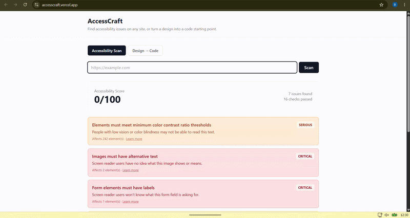
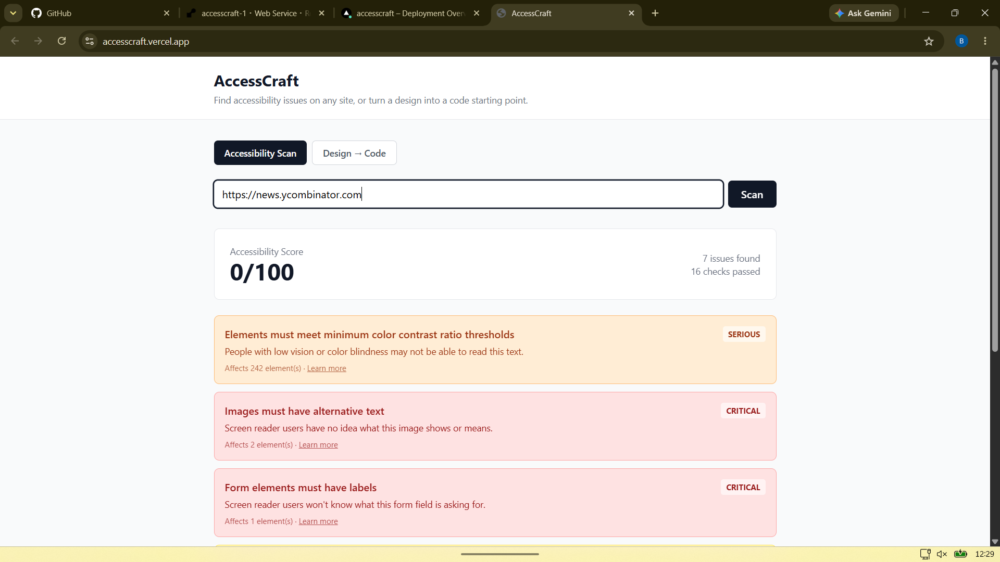
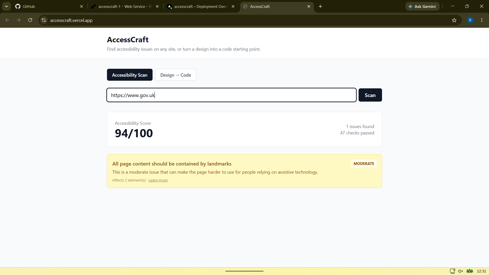
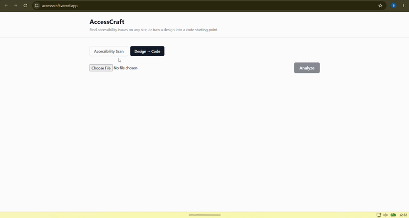
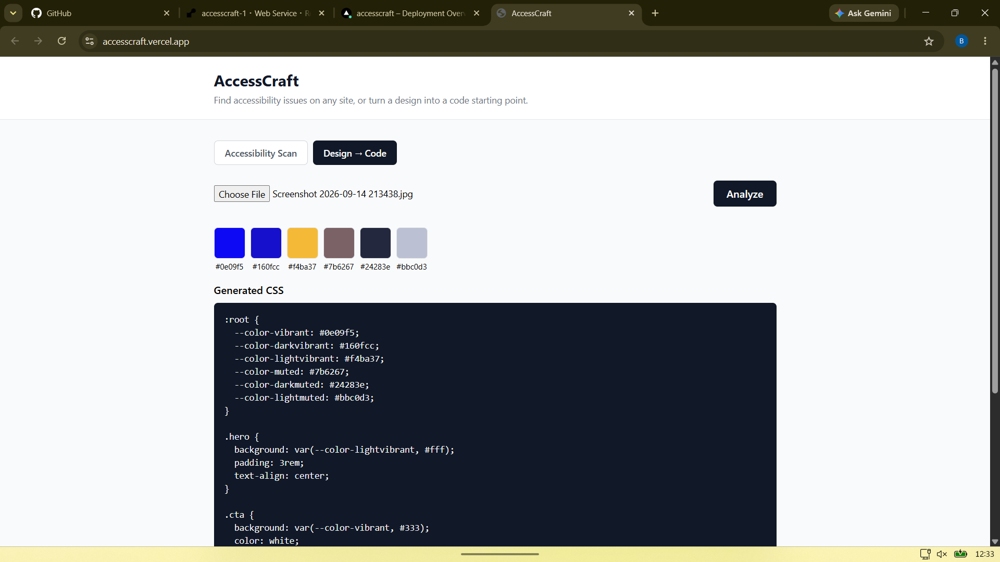

# AccessCraft

A tool that helps developers and designers build websites everyone can use — it scans live sites for accessibility issues (using axe-core, the industry-standard engine) and turns uploaded design images into a working HTML/CSS starting point.

## Why this project

Millions of people rely on assistive technology (screen readers, keyboard navigation, high-contrast modes) to use the web. Many sites unintentionally lock these users out — missing alt text, low-contrast text, unlabeled forms. AccessCraft catches these issues automatically and explains *why* each one matters in plain English, so developers without accessibility training can still fix them.

The design-to-code half speeds up the handoff between designer and developer — turning a static image into a real code starting point instead of a blank file.

## Tech stack

- **Frontend:** React, Vite, Tailwind CSS
- **Backend:** Node.js, Express
- **Accessibility engine:** axe-core + Puppeteer (headless Chrome)
- **Design analysis:** node-vibrant (color extraction)
- **Database:** SQLite (scan history)

## Setup

### Backend
```bash
cd backend
npm install
cp .env.example .env
npm run dev
```

### Frontend
```bash
cd frontend
npm install
npm run dev
```

Visit `http://localhost:5173`. The frontend proxies `/api` requests to the backend on port 5000.

## Roadmap

- [x] URL accessibility scanning with axe-core
- [x] Plain-English explanations per issue
- [x] Basic design-to-code (color palette + starter markup)
- [ ] Layout block detection (header/nav/cards) for design-to-code
- [ ] Scan history + saved reports
- [ ] PDF export of reports
- [ ] User accounts

## License

MIT


## Screenshots

### Accessibility Scan
 



### Design to Code

